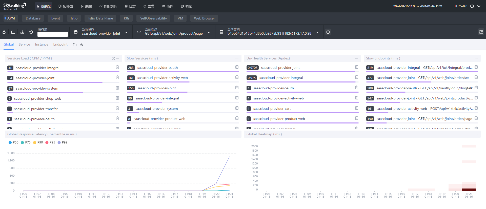

# Apache SkyWalking

分布式系统的应用程序性能监控工具，特别为微服务、云原生和基于容器(Kubernetes)架构设计。

- https://github.com/apache/skywalking
- https://skywalking.apache.org

### 部署

```shell
docker-compose -f docker-compose.yml -p skywalking up -d

# 运行后，给当前目录下所有文件赋予权限(读、写、执行)
# chmod -R 777 ./elasticsearch
```

访问 http://127.0.0.1:18080

### Java项目配置

下载`Java Agent` https://skywalking.apache.org/downloads/

> eg: https://dlcdn.apache.org/skywalking/java-agent/8.15.0/apache-skywalking-java-agent-8.15.0.tgz

修改`skywalking-agent\config\agent.config`中配置参数 或 在jvm运行的时候指定

在java项目运行启动的时候，添加如下运行参数

```shell
# SW_AGENT_NAME：应用名
# SW_AGENT_COLLECTOR_BACKEND_SERVICES：数据收集地址
# 下面的配置最终展示的Service Names为："app-demo|dev|test"
-javaagent:D:\tmp\skywalking-agent\skywalking-agent.jar -DSW_AGENT_CLUSTER=test -DSW_AGENT_NAMESPACE=dev -DSW_AGENT_NAME=app-demo -DSW_AGENT_COLLECTOR_BACKEND_SERVICES=127.0.0.1:11800
```

项目跑起来之后调用下接口，就可以去SkyWalking中查看拓扑图，追踪等信息了...


